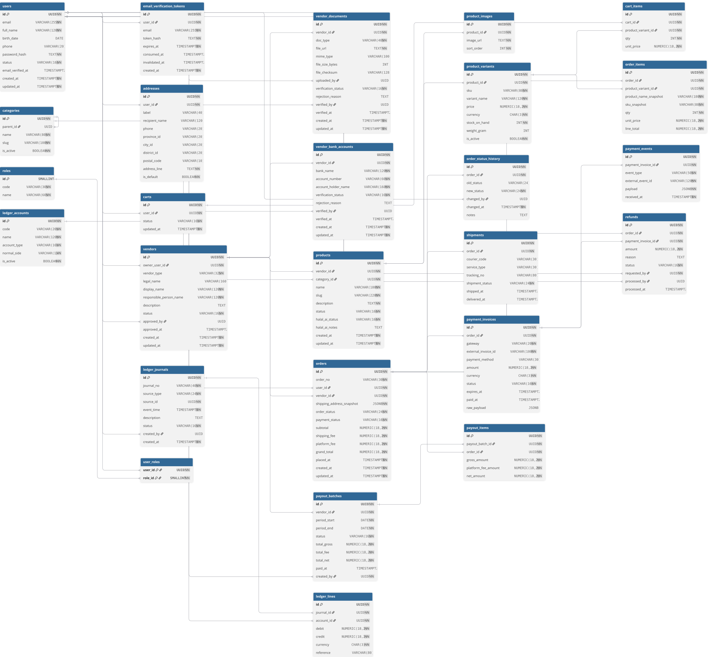

# Haji Umroh Store BE

Go backend for a Haji/Umroh souvenir e-commerce platform. Built with Clean Architecture and PostgreSQL as the database.

## Tech Stack

- **Go** (1.25+) with **Gin** HTTP framework
- **GORM** ORM with **PostgreSQL**
- **Viper** for configuration management
- **golang-migrate** for database migrations
- **go.uber.org/mock** for test mocking

## Architecture

Clean Architecture with four layers (dependency flows inward):

```
delivery/http  →  usecase  →  domain  ←  repository
     │                                        │
     └──── infrastructure (db, s3, smtp) ─────┘
```

| Layer | Path | Responsibility |
|---|---|---|
| Domain | `internal/domain/` | Core entities, DTOs, and interface contracts. No external dependencies. |
| Usecase | `internal/usecase/` | Business logic. Each feature has its own file. Returns sentinel errors defined in `errors.go`. |
| Repository | `internal/repository/` | GORM-based data access using internal DB models. |
| Delivery | `internal/delivery/http/` | Gin HTTP handlers, middleware (Auth, CORS, Recovery, RequestID), and route registration. |
| Infrastructure | `internal/infrastructure/` | External service integrations: PostgreSQL (GORM), S3 storage (presigned URLs), SMTP email. |
| Config | `internal/config/` | Viper-based configuration loading from `.env` and environment variables. |
| Utilities | `pkg/` | Shared JSON response envelope (`pkg/response/`) and auth helpers (`pkg/utils/auth/` — JWT, password hashing). |

Dependencies are wired in `internal/app/app.go` via the `Initialize()` function, used by the HTTP server entry point.

## Database Design



The schema covers identity & access, vendors, product catalog, cart, orders & shipping, payments & refunds, payouts, and double-entry bookkeeping ledger. Migrations are in the `migrations/` directory.

## Prerequisites

- [Go](https://go.dev/dl/) 1.25+
- [Docker](https://docs.docker.com/get-docker/) & Docker Compose
- [golang-migrate](https://github.com/golang-migrate/migrate) CLI

## Getting Started

1. Clone the repository:
   ```bash
   git clone https://github.com/media-inovasi-strategis/haji-umroh-store-be.git
   cd haji-umroh-store-be
   ```

2. Copy the environment file and adjust as needed:
   ```bash
   cp .env.example .env
   ```

3. Start the database, set up the schema, seed the admin user, and run the server:
   ```bash
   make docker-up
   make db-setup       # creates database + applies all migrations
   make seed           # seeds admin user from ADMIN_* env vars
   make run
   ```

The API server will be available at `http://localhost:8080`.

## Environment Variables

### Application

| Variable | Default | Description |
|---|---|---|
| `APP_NAME` | `haji-umroh-store-be` | Application name |
| `APP_PORT` | `8080` | HTTP server port |
| `APP_ENV` | `development` | Environment (development/production) |
| `APP_BASE_URL` | — | Application base URL |
| `APP_FRONTEND_URL` | — | Frontend URL (used in email links) |

### Database

| Variable | Default | Description |
|---|---|---|
| `DB_HOST` | `localhost` | Database host |
| `DB_PORT` | `5432` | Database port |
| `DB_USER` | `postgres` | Database user |
| `DB_PASSWORD` | `postgres` | Database password |
| `DB_NAME` | `haji_umroh_store` | Database name |
| `DB_SSLMODE` | `disable` | SSL mode |
| `DB_MAX_IDLE_CONNS` | `10` | Max idle connections |
| `DB_MAX_OPEN_CONNS` | `100` | Max open connections |

### JWT

| Variable | Default | Description |
|---|---|---|
| `JWT_SECRET` | — | Secret key for signing JWTs |
| `JWT_EXPIRY_HOURS` | `24` | Token expiry duration in hours |
| `JWT_ISSUER` | `haji-umroh-store-be` | JWT issuer |

### Object Storage (S3)

| Variable | Default | Description |
|---|---|---|
| `STORAGE_PROVIDER` | `s3` | Storage provider type |
| `STORAGE_S3_REGION` | `ap-southeast-1` | AWS region |
| `STORAGE_S3_BUCKET` | — | S3 bucket name |
| `STORAGE_S3_ACCESS_KEY` | — | AWS access key |
| `STORAGE_S3_SECRET_KEY` | — | AWS secret key |
| `STORAGE_S3_ENDPOINT` | — | S3 endpoint URL |
| `STORAGE_S3_FORCE_PATH_STYLE` | `false` | Force path-style URLs |
| `STORAGE_BASE_URL` | — | Public S3 base URL |
| `STORAGE_UPLOAD_MAX_SIZE_MB` | `10` | Max upload size in MB |

### Email (SMTP)

| Variable | Default | Description |
|---|---|---|
| `SMTP_HOST` | `smtp.gmail.com` | SMTP server host |
| `SMTP_PORT` | `587` | SMTP port |
| `SMTP_USERNAME` | — | SMTP username |
| `SMTP_PASSWORD` | — | SMTP password (Gmail: use App Password) |
| `SMTP_FROM_EMAIL` | — | Sender email address |
| `SMTP_FROM_NAME` | — | Sender display name |

### Admin Seed

| Variable | Default | Description |
|---|---|---|
| `ADMIN_EMAIL` | — | Admin email for seeding |
| `ADMIN_PASSWORD` | — | Admin password for seeding |
| `ADMIN_NAME` | — | Admin full name |
| `ADMIN_PHONE` | — | Admin phone number |

## Development Commands

| Command | Description |
|---|---|
| `make run` | Start API server (`go run cmd/api/main.go`) |
| `make build` | Build binary to `bin/api` |
| `make test` | Run all tests (`go test ./... -v`) |
| `make tidy` | Clean Go module dependencies |
| `make docker-up` | Start PostgreSQL via Docker Compose |
| `make docker-down` | Stop Docker Compose services |
| `make db-setup` | Create database + apply all migrations |
| `make migrate-up` | Apply all pending migrations |
| `make migrate-down` | Rollback last migration |
| `make migrate-create name=<name>` | Create new migration pair in `migrations/` |
| `make seed` | Seed admin user from `ADMIN_*` env vars |

Run a single test:
```bash
go test -v -run TestFunctionName ./internal/usecase/...
```

## API Endpoints

All routes are grouped under `/api/v1`. Responses use a standard JSON envelope: `{success, message, data, errors, meta}`.

| Group | Prefix | Description |
|---|---|---|
| **Public** | `/api/v1/` | Health check, product categories, shipping services |
| **Auth** | `/api/v1/users/`, `/api/v1/vendors/`, `/api/v1/admin/` | Registration, login, email verification (public) |
| **Customer** | `/api/v1/users/` | User profile, shopping cart management |
| **Vendor** | `/api/v1/vendors/` | Document confirmation, product creation and image management |
| **Admin** | `/api/v1/admin/` | User CRUD, vendor approval workflow (approve, reject, block, unblock) |

**Middleware chain** (applied in order): Recovery, CORS, RequestID (`X-Request-ID`), Auth (JWT), RequireRoles.

> For detailed request/response examples, see the [Postman Collection](https://www.postman.com/garudalabs/kemenhaj/overview).

## Project Structure

```
.
├── cmd/
│   ├── api/main.go                # HTTP server entry point
│   └── seed/main.go               # Admin user seeding command
├── internal/
│   ├── app/app.go                 # Dependency wiring
│   ├── config/                    # Configuration loading
│   ├── delivery/http/
│   │   ├── handler/               # HTTP handlers + error mapper
│   │   ├── middleware/            # Auth, CORS, Recovery, RequestID
│   │   └── router/               # Route registration
│   ├── domain/                    # Entities, DTOs, and interface contracts
│   ├── infrastructure/
│   │   ├── database/              # PostgreSQL connection (GORM)
│   │   ├── storage/               # S3 storage provider
│   │   └── email/                 # SMTP email provider
│   ├── repository/                # Data access implementations
│   └── usecase/                   # Business logic + mocks for testing
├── pkg/
│   ├── response/                  # Shared JSON response envelope
│   └── utils/auth/                # JWT and password hashing helpers
├── migrations/                    # SQL migration files
├── docs/                          # OpenAPI specs and database design
├── Dockerfile                     # Container image build
├── docker-compose.yml             # PostgreSQL setup
├── Makefile                       # Development commands
└── .env.example                   # Environment variable template
```
